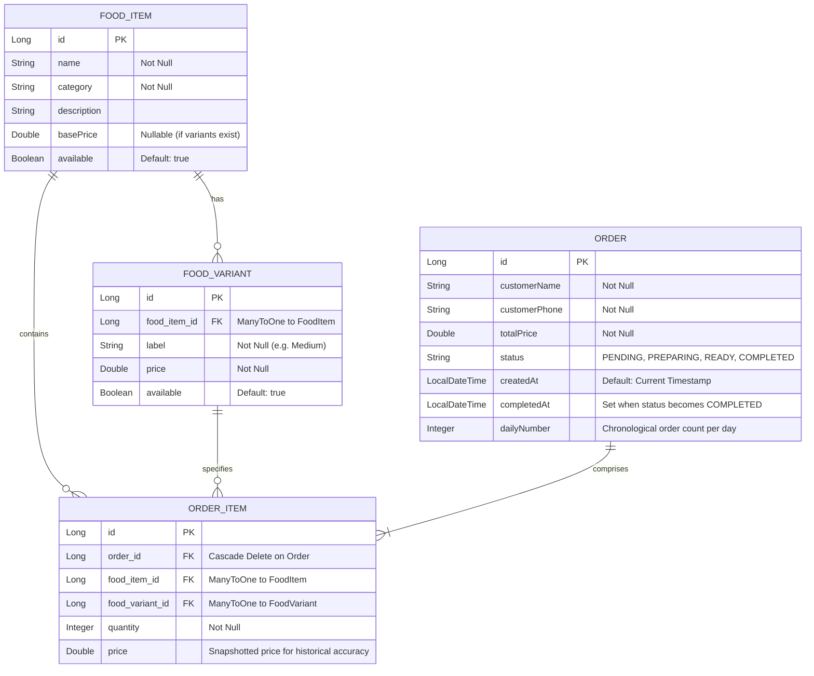

# 🍳 Home Kitchen - Full-Stack Food Ordering Platform

**Home Kitchen** is a responsive, production-ready, full-stack food ordering and management platform designed specifically for small-scale food businesses like home-kitchens, cafes, and snack bars.

The system features a modern, beautifully designed customer-facing interface for browsing categorized menu items and managing an active cart, combined with a secure admin dashboard for tracking orders, managing menu CRUD operations, and reviewing daily revenue insights.

---

## 🚀 Key Features

### 🛒 Customer Ordering & Experience
- **📂 Categorized Menu**: Browse items dynamically by category with intuitive pill filters and custom category icons.
- **🛒 Dynamic Cart Management**: Add items, customize variants (e.g., portion sizes), adjust quantities, and view real-time calculations.
- **📋 Seamless Checkout Drawer**: Input customer details (Name, Phone Number) with custom input validation.
- **📱 Enforced 10-Digit Phone Check**: Prevents order placement without a valid 10-digit phone number.
- **🔔 Premium Top-Sliding Toasts**: Displays errors and successes using high-fidelity, top-sliding custom notification banners instead of browser-native `alert()` dialogs.
- **📍 Live Order Status Tracker**:
  - Provides a real-time progress timeline mapping: `Order Placed` ➔ `Preparing Meal` ➔ `Ready for Pickup` ➔ `Picked Up`.
  - Automatically polls backend status changes every **4 seconds** in the background.
  - Automatically expires and disappears **5 minutes** after the admin marks the order as `COMPLETED`.

### 📊 Admin Operations Dashboard
- **📋 Live Orders Console**: Real-time order monitoring dashboard displaying customer details, ordered items, and current status.
- **🔄 Order Status Workflow**: Transition orders seamlessly through 4 states: `PENDING` ➔ `PREPARING` ➔ `READY` ➔ `COMPLETED`.
- **📅 Daily Insights & Metrics**: Review total daily revenue and total orders for a chosen date using calendar filtering.
- **🔢 Daily Order Numbers**: Display chronological daily order numbers (e.g., Order #1, Order #2) instead of raw database IDs.
- **🛠️ Menu CRUD Management**: Fully-featured interface to add, edit, configure multi-portion price variants, toggle availability of, and delete menu items on the fly.

### ⚙️ Backend & Engineering Highlights
- **🔒 Data Consistency (ACID)**: Uses Spring's declarative `@Transactional` management to ensure multi-table writes (orders & order items) succeed or fail atomically.
- **🛡️ Deserialization Safety**: All entities use wrapper classes (`Boolean`, `Double`, `Integer`) to gracefully handle partial JSON requests and avoid primitive deserialization errors.
- **🏷️ Price Snapshotting**: Prevents historical order revenue changes by storing the exact `price` in `OrderItem` records at checkout time.
- **🛡️ Global Exception Handling**: Centralized exception handler maps custom errors to clean JSON API responses instead of raw stack traces.

---

## 🏛️ System Architecture

The application follows the industry-standard **Three-Tier Architecture** pattern, enforcing a strict separation of concerns between presentation, business logic, and data persistence.

```mermaid
graph TD
    subgraph Client Tier (Frontend)
        A[React App / Vite] -->|State Management| B[React Hooks: useState, useEffect]
        A -->|Styling| C[Tailwind CSS v4 & custom micro-animations]
    end

    subgraph Presentation & Security Tier (API Gate)
        A -->|HTTP Requests| D[Spring Boot Controllers]
        D -->|Cors Configuration| E[Cors Configuration]
    end

    subgraph Business Logic Tier (Backend)
        D -->|Service Layer Interface| F[FoodService & OrderService]
        F -->|Global Exception Handling| G[GlobalExceptionHandler & Custom Exceptions]
    end

    subgraph Data Access Tier (Database)
        F -->|Spring Data JPA / Hibernate| H[Repository Interfaces]
        H -->|Queries| I[(MySQL Database)]
    end
```

---

## 🗄️ Database Schema & Entities

The relational database schema is designed to support transactional consistency, particularly when processing orders and maintaining active menus.



---

## 🛠️ Tech Stack

### Frontend
- **React & Vite**: Modern component-based view rendering and fast development builds.
- **React Router**: Single-Page Application (SPA) client-side routing.
- **Tailwind CSS v4**: Utility-first CSS styling framework.
- **Lucide React**: Clean and modern vector icon library.

### Backend & Database
- **Spring Boot**: REST API creation and dependency injection.
- **Spring Data JPA & Hibernate**: Object-Relational Mapping (ORM) and abstract repository pattern.
- **MySQL**: Relational database storage.

---

## 📂 Folder Structure

```text
home-kitchen/
├── backend/
│   └── src/main/java/com/homekitchen/backend/
│       ├── controller/
│       │   ├── AuthController.java       # POST /auth/login → Admin authentication
│       │   ├── HomeController.java       # Food item CRUD
│       │   └── OrderController.java      # Order CRUD & status transitions
│       ├── dto/
│       │   └── ApiResponse.java
│       ├── exception/
│       │   ├── FoodException.java
│       │   └── GlobalExceptionHandler.java
│       ├── model/
│       │   ├── FoodItem.java
│       │   ├── FoodVariant.java
│       │   ├── Order.java
│       │   └── OrderItem.java
│       ├── repository/
│       │   ├── FoodItemRepository.java
│       │   ├── OrderItemRepository.java
│       │   └── OrderRepository.java
│       └── service/
│           ├── FoodService.java
│           └── OrderService.java
├── frontend/
│   ├── src/
│   │   ├── pages/
│   │   │   ├── AdminPage.jsx             # Admin login + Menu control + Orders console
│   │   │   └── CustomerPage.jsx          # Menu feed + customization modal + Live tracker
│   │   ├── App.jsx
│   │   ├── index.css                 # Custom keyframes & Tailwind imports
│   │   └── main.jsx
│   └── vercel.json                   # Rewrite configuration for SPA client routing
└── README.md
```

---

## ⚙️ Local Setup

### Prerequisites
- **Java 17+**
- **Node.js 18+**
- **MySQL Server**

### 1. Database Creation
Create a MySQL database schema:
```sql
CREATE DATABASE home_kitchen;
```

Update database credentials in [application.properties](file:///d:/Projects/home-kitchen/backend/src/main/resources/application.properties):
```properties
spring.datasource.url=jdbc:mysql://localhost:3306/home_kitchen
spring.datasource.username=YOUR_MYSQL_USERNAME
spring.datasource.password=YOUR_MYSQL_PASSWORD
spring.jpa.hibernate.ddl-auto=update
```

### 2. Run Backend
Navigate to the backend directory and launch the Spring Boot application:
```bash
cd backend
.\mvnw.cmd clean spring-boot:run
```
The server will run on `http://localhost:8080`.

### 3. Run Frontend
Navigate to the frontend directory, install npm packages, and run the development server:
```bash
cd frontend
npm install
npm run dev
```
The application will open on `http://localhost:5173`.

### 4. Admin Dashboard Credentials
Access the admin interface at `http://localhost:5173/admin` with:
- **Username**: `admin`
- **Password**: `admin123`

---

## 🔌 API Reference

### Auth Endpoint
| Method | Endpoint | Description |
|--------|----------|-------------|
| `POST` | `/auth/login` | Login and verify credentials |

### Food Items (`/foods`)
| Method | Endpoint | Description | Auth Required |
|--------|----------|-------------|---------------|
| `GET` | `/foods` | Get all food items | No |
| `POST` | `/foods` | Add a new food item | **Yes** (Admin Login) |
| `PUT` | `/foods/{id}` | Update an existing food item | **Yes** (Admin Login) |
| `DELETE` | `/foods/{id}` | Delete a food item | **Yes** (Admin Login) |

### Orders (`/orders`)
| Method | Endpoint | Description | Auth Required |
|--------|----------|-------------|---------------|
| `POST` | `/orders` | Place a new order | No |
| `GET` | `/orders` | Fetch all orders | **Yes** (Admin Login) |
| `GET` | `/orders/{id}` | Fetch a single order status for tracking | No |
| `PATCH` | `/orders/{id}/status` | Update status (`PENDING` ➔ `PREPARING` ➔ `READY` ➔ `COMPLETED`) | **Yes** (Admin Login) |
| `DELETE` | `/orders/{id}` | Delete a specific order record | **Yes** (Admin Login) |
| `DELETE` | `/orders/completed` | Clear all orders marked as `COMPLETED` | **Yes** (Admin Login) |
| `DELETE` | `/orders` | Wipe all order records | **Yes** (Admin Login) |