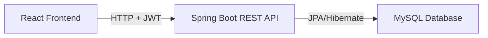

# Home Kitchen 🍳

A full-stack food ordering platform for small eateries — snack bars, home kitchens, ice cream parlors, and cafes. Customers browse the menu and place orders; the admin manages the menu and tracks orders in real time.

---

## 🚀 Features

- **🛒 Cart & Ordering** — Add items, adjust quantities, and place orders with a smooth checkout drawer
- **📂 Categorized Menu** — Browse by category with pill filters and emoji section headers
- **🔒 JWT Admin Auth** — Secure login with token-based authentication (no plain passwords)
- **📋 Live Orders Panel** — Admin sees incoming orders, confirms them, and marks them done
- **📅 Daily Insights & Filtering** — Filter orders by date, view daily revenue, and see daily order numbers instead of database IDs
- **⚡ Full CRUD API** — Complete REST API for food items and orders
- **✅ Validations** — Input checks on both client and server with custom exception handling

---

## 🛠️ Tech Stack

### Frontend


### Backend & Database


### Tools


---

## 🏛️ Architecture



---

## 📂 Folder Structure

```text
home-kitchen/
├── backend/
│   └── src/main/java/com/homekitchen/backend/
│       ├── controller/
│       │   ├── AuthController.java       # POST /auth/login → JWT token
│       │   ├── HomeController.java       # Food item CRUD
│       │   └── OrderController.java      # Order placement & status updates
│       ├── dto/
│       │   └── ApiResponse.java
│       ├── exception/
│       │   ├── FoodException.java
│       │   └── GlobalExceptionHandler.java
│       ├── model/
│       │   ├── FoodItem.java
│       │   ├── Order.java
│       │   └── OrderItem.java
│       ├── repository/
│       │   ├── FoodItemRepository.java
│       │   ├── OrderItemRepository.java
│       │   └── OrderRepository.java
│       ├── service/
│       │   ├── FoodService.java
│       │   └── OrderService.java
│       └── util/
│           └── JwtUtil.java              # Token generation & validation
├── frontend/
│   └── src/
│       ├── pages/
│       │   ├── AdminPage.jsx             # Login + Menu + Orders tabs
│       │   └── CustomerPage.jsx          # Menu browsing + cart + checkout
│       ├── Admin.css
│       ├── App.css
│       ├── App.jsx
│       └── main.jsx
└── README.md
```

---

## ⚙️ Local Setup

### Prerequisites
- Java 17+
- Node 18+
- MySQL running locally

### 1. Database
```sql
CREATE DATABASE home_kitchen;
```

Then update `backend/src/main/resources/application.properties`:
```properties
spring.datasource.url=jdbc:mysql://localhost:3306/home_kitchen
spring.datasource.username=YOUR_USERNAME
spring.datasource.password=YOUR_PASSWORD
spring.jpa.hibernate.ddl-auto=update
```

### 2. Backend
```bash
cd backend

# Windows
.\mvnw.cmd spring-boot:run

# Mac / Linux
./mvnw spring-boot:run
```
Runs on `http://localhost:8080`

### 3. Frontend
```bash
cd frontend
npm install
npm run dev
```
Runs on `http://localhost:5173`

### 4. Admin Login
Go to `http://localhost:5173/admin`

| Field | Value |
|-------|-------|
| Username | `admin` |
| Password | `admin123` |

---

## 🔌 API Reference

### Auth
| Method | Endpoint | Description |
|--------|----------|-------------|
| `POST` | `/auth/login` | Login and receive a JWT token |

### Food Items (`/foods`)
| Method | Endpoint | Description |
|--------|----------|-------------|
| `GET` | `/foods` | Get all food items |
| `GET` | `/foods/category/{category}` | Filter by category |
| `POST` | `/foods` | Add a new item |
| `PUT` | `/foods/{id}` | Update an item |
| `DELETE` | `/foods/{id}` | Delete an item |

### Orders (`/orders`)
| Method | Endpoint | Description |
|--------|----------|-------------|
| `POST` | `/orders` | Place a new order |
| `GET` | `/orders` | Get all orders |
| `PATCH` | `/orders/{id}/status` | Update order status (`PENDING` → `CONFIRMED` → `DONE`) |
| `DELETE` | `/orders/{id}` | Delete a specific order |
| `DELETE` | `/orders/completed` | Delete all completed orders |
| `DELETE` | `/orders` | Clear all orders |

---

## 🛠️ Troubleshooting

**Port 8080 already in use (Windows)**
```bash
netstat -ano | findstr :8080
taskkill /PID <PID> /F
```

**CORS errors** — Make sure both `HomeController.java`, `OrderController.java`, and `AuthController.java` have:
```java
@CrossOrigin(origins = "http://localhost:5173/")
```

**Wrong Java version** — Backend requires JDK 17+. Check with:
```bash
java -version
```

---

## 🔮 Roadmap

- [ ] Restaurant open/closed toggle
- [ ] Dark mode
- [ ] Image uploads for menu items (AWS S3 or Cloudinary)