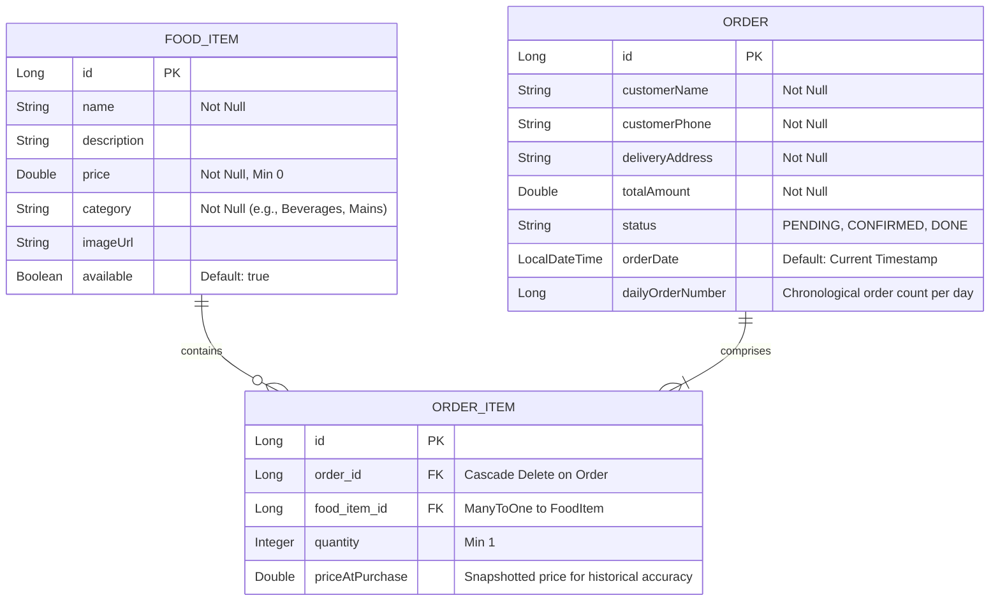

# 🍳 Home Kitchen - Full-Stack Food Ordering Platform

**Home Kitchen** is a responsive, production-ready, full-stack food ordering and management platform designed specifically for small-scale food businesses like home-kitchens, cafes, and snack bars. 

The system features a modern, clean customer-facing interface for browsing categorized menu items and managing an active cart, combined with a secure, JWT-authenticated admin dashboard for tracking orders, managing menu CRUD operations, and reviewing daily revenue insights.

---

## 🚀 Key Features

### 🛒 Customer Ordering & Experience
- **📂 Categorized Menu**: Browse items dynamically by category with intuitive pill filters and custom emoji section headers.
- **🛒 Dynamic Cart Management**: Add items, adjust quantities, and view real-time price calculations.
- **📋 Seamless Checkout Drawer**: Input customer details (Name, Phone, Delivery Address) and submit orders instantly.
- **✨ Responsive Design**: Fully responsive layout optimized for mobile, tablet, and desktop screens using Vanilla CSS.

### 🔒 Admin Security & Authentication
- **🔑 Session-Based Active Admin Flags**: Admin logins verify credentials and store a local storage flag (`adminLoggedIn`) to persist the active dashboard session.
- **❌ Secure Router Guards**: Prevent unauthorized users from accessing the admin dashboard or triggering management APIs.

### 📊 Admin Operations Dashboard
- **📋 Live Orders Tracking**: Real-time order monitoring console displaying customer details, ordered items, and current status.
- **🔄 Order Status Workflow**: Transition orders seamlessly through their lifecycle (`PENDING` ➔ `CONFIRMED` ➔ `DONE`).
- **📅 Daily Insights & Metrics**: Review total daily revenue and total orders for a chosen date using calendar filtering.
- **🔢 Daily Order Numbers**: Display chronological daily order numbers (e.g., Order #1, Order #2) instead of raw database IDs.
- **🛠️ Menu CRUD Management**: Fully-featured interface to add, edit, toggle availability of, and delete menu items on the fly.

### ⚙️ Backend & Engineering Highlights
- **🔒 Data Consistency (ACID)**: Uses Spring's declarative `@Transactional` management to ensure multi-table writes (orders & order items) succeed or fail atomically.
- **🏷️ Price Snapshotting**: Prevents historical order revenue changes by storing the exact `priceAtPurchase` in `OrderItem` records at checkout time.
- **🛡️ Global Exception Handling**: Centralized exception handler maps custom errors to clean JSON API responses instead of raw stack traces.
- **✅ Server-Side Validation**: Enforces input constraints (e.g., non-empty strings, positive numbers) using JSR-380 annotations.

---

## 🏛️ System Architecture

The application follows the industry-standard **Three-Tier Architecture** pattern, enforcing a strict separation of concerns between presentation, business logic, and data persistence.

```mermaid
graph TD
    subgraph Client Tier (Frontend)
        A[React App / Vite] -->|State Management| B[React Hooks: useState, useEffect]
        A -->|Styling| C[Vanilla CSS Flexbox/Grid]
    end

    subgraph Presentation & Security Tier (API Gate)
        A -->|HTTP Requests| D[Spring Boot Controllers]
        D -->|Cors Configuration| E[Cors Configuration]
    end

    subgraph Business Logic Tier (Backend)
        D -->|Service Layer Interface| F[FoodService & OrderService]
        F -->|Global Exception Handling| G[GlobalExceptionHandler & Custom Exceptions]
    end

    subgraph Data Access Tier (Database)
        F -->|Spring Data JPA / Hibernate| H[Repository Interfaces]
        H -->|Queries| I[(MySQL Database)]
    end
```

---

## 🗄️ Database Schema & Entities

The relational database schema is designed to support transactional consistency, particularly when processing orders and maintaining active menus.



---

## 🛠️ Tech Stack

### Frontend
- **React & Vite**: Modern component-based view rendering and fast development builds.
- **React Router**: Single-Page Application (SPA) client-side routing.
- **Vanilla CSS**: Clean layouts utilizing Flexbox, Grid, custom properties, and micro-animations.

### Backend & Database
- **Spring Boot**: REST API creation, dependency injection, and security.
- **Spring Data JPA & Hibernate**: Object-Relational Mapping (ORM) and abstract repository pattern.
- **MySQL**: Relational database storage.

### Tools & Package Managers
- **Maven**: Dependency resolution and backend build tool.
- **NPM**: Frontend package management.
- **Git**: Distributed version control.

---

## 📂 Folder Structure

```text
home-kitchen/
├── backend/
│   └── src/main/java/com/homekitchen/backend/
│       ├── controller/
│       │   ├── AuthController.java       # POST /auth/login → Credentials validation
│       │   ├── HomeController.java       # Food item CRUD
│       │   └── OrderController.java      # Order placement & status updates
│       ├── dto/
│       │   └── ApiResponse.java
│       ├── exception/
│       │   ├── FoodException.java
│       │   └── GlobalExceptionHandler.java
│       ├── model/
│       │   ├── FoodItem.java
│       │   ├── Order.java
│       │   └── OrderItem.java
│       ├── repository/
│       │   ├── FoodItemRepository.java
│       │   ├── OrderItemRepository.java
│       │   └── OrderRepository.java
│       └── service/
│           ├── FoodService.java
│           └── OrderService.java
├── frontend/
│   └── src/
│       ├── pages/
│       │   ├── AdminPage.jsx             # Login + Menu + Orders tabs
│       │   └── CustomerPage.jsx          # Menu browsing + cart + checkout
│       ├── Admin.css
│       ├── App.css
│       ├── App.jsx
│       └── main.jsx
└── README.md
```

---

## ⚙️ Local Setup

### Prerequisites
- **Java 17+** (JDK 17 or higher)
- **Node.js 18+**
- **MySQL Server**

### 1. Database Creation
Create a MySQL database schemas:
```sql
CREATE DATABASE home_kitchen;
```

Update database credentials in [application.properties](file:///d:/Projects/home-kitchen/backend/src/main/resources/application.properties):
```properties
spring.datasource.url=jdbc:mysql://localhost:3306/home_kitchen
spring.datasource.username=YOUR_MYSQL_USERNAME
spring.datasource.password=YOUR_MYSQL_PASSWORD
spring.jpa.hibernate.ddl-auto=update
```

### 2. Run Backend
Navigate to the backend directory and launch the Spring Boot application:
```bash
cd backend

# Windows
.\mvnw.cmd spring-boot:run

# Mac / Linux
./mvnw spring-boot:run
```
The server will run on `http://localhost:8080`.

### 3. Run Frontend
Navigate to the frontend directory, install npm packages, and run the development server:
```bash
cd frontend
npm install
npm run dev
```
The application will open on `http://localhost:5173`.

### 4. Admin Dashboard Credentials
Access the admin interface at `http://localhost:5173/admin` with:
- **Username**: `admin`
- **Password**: `admin123`

---

## 🔌 API Reference

### Auth Endpoint
| Method | Endpoint | Description | Headers |
|--------|----------|-------------|---------|
| `POST` | `/api/auth/login` | Login and verify credentials | None |

### Food Items (`/api/foods`)
| Method | Endpoint | Description | Auth Required |
|--------|----------|-------------|---------------|
| `GET` | `/api/foods` | Get all food items | No |
| `GET` | `/api/foods/category/{category}` | Filter food items by category name | No |
| `POST` | `/api/api/foods` | Add a new food item to the menu | **Yes** (Admin Login) |
| `PUT` | `/api/foods/{id}` | Update an existing food item | **Yes** (Admin Login) |
| `DELETE` | `/api/foods/{id}` | Delete a food item | **Yes** (Admin Login) |

### Orders (`/api/orders`)
| Method | Endpoint | Description | Auth Required |
|--------|----------|-------------|---------------|
| `POST` | `/api/orders` | Place a new order | No |
| `GET` | `/api/orders` | Fetch all orders | **Yes** (Admin Login) |
| `PATCH` | `/api/orders/{id}/status` | Update order status (`PENDING` ➔ `CONFIRMED` ➔ `DONE`) | **Yes** (Admin Login) |
| `DELETE` | `/api/orders/{id}` | Delete a specific order record | **Yes** (Admin Login) |
| `DELETE` | `/api/orders/completed` | Clear all orders marked as `DONE` | **Yes** (Admin Login) |
| `DELETE` | `/api/orders` | Wipe all order records | **Yes** (Admin Login) |

---

## 🛠️ Troubleshooting & Configuration

- **Port 8080 is already in use (Windows)**:
  Find and kill the process running on port 8080:
  ```powershell
  netstat -ano | findstr :8080
  taskkill /PID <PID> /F
  ```
- **CORS blockages**: Ensure that backend controllers have `@CrossOrigin(origins = "http://localhost:5173/")` annotations matching the local frontend dev URL.
- **Java Version verification**:
  Verify the current run environment:
  ```bash
  java -version
  ```

---

## 🔮 Future Roadmap
- [ ] Live restaurant open/closed status toggle.
- [ ] Native dark/light mode toggle with CSS Variables.
- [ ] AWS S3 or Cloudinary integration for menu image uploads.
- [ ] SSE (Server-Sent Events) or WebSockets for instant admin notifications of incoming orders.