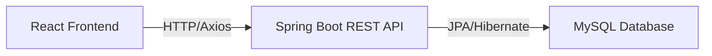

# Home Kitchen 🍳

Home Kitchen is a professional full-stack cafe and restaurant management platform designed for snack bars, ice cream parlors, and small eateries. This application allows users to manage their menu efficiently for Dine-in and Takeaway services with a responsive React frontend and a robust Spring Boot backend.

---

## 🚀 Features

- **Menu Management**: Add, view, update, and delete food items.
- **Bulk Actions**: Support for deleting all items at once.
- **Categorization**: Group food items by category for easier navigation.
- **Validation**: Server-side validation and exception handling for reliable data processing.
- **Responsive Design**: Modern UI built with React and Vanilla CSS.
- **Dine-in & Takeaway Focus**: Optimized for in-shop ordering and management.
- **Persistent Storage**: Full integration with MySQL database via Spring Data JPA.

---

## 🛠️ Tech Stack

- **Frontend**: [React](https://reactjs.org/) (Vite), Axios, Vanilla CSS
- **Backend**: [Spring Boot](https://spring.io/projects/spring-boot) (Java 17)
- **Database**: [MySQL](https://www.mysql.com/)
- **Build Tools**: Maven, npm

---

## 🏛️ Project Architecture



---

## 📂 Folder Structure

```text
home-kitchen/
├── backend/                # Spring Boot application
│   ├── src/main/java/      # Java source code
│   │   └── com/homekitchen/backend/
│   │       ├── controller/ # REST Endpoints
│   │       ├── dto/        # Data Transfer Objects
│   │       ├── exception/  # Global Exception Handling
│   │       ├── model/      # JPA Entities
│   │       ├── repository/ # Data Access Layer
│   │       └── service/    # Business Logic
│   ├── src/main/resources/ # Configuration (application.properties)
│   └── pom.xml             # Maven dependencies
├── frontend/               # React application
│   ├── src/
│   │   ├── assets/         # Static images/icons
│   │   ├── App.jsx         # Main application logic
│   │   └── main.jsx        # Entry point
│   ├── index.html
│   └── package.json        # Node dependencies
└── README.md
```

---

## ⚙️ Setup & Installation

### 1. Database Setup

1. Open your MySQL client (Command Line or Workbench).
2. Create a new database:
   ```sql
   CREATE DATABASE home_kitchen;
   ```
3. Update the credentials in `backend/src/main/resources/application.properties`:
   ```properties
   spring.datasource.username=YOUR_USERNAME
   spring.datasource.password=YOUR_PASSWORD
   ```

### 2. Backend Setup

1. Navigate to the backend directory:
   ```powershell
   cd backend
   ```
2. Run the application using the Maven wrapper:
   ```powershell
   .\mvnw.cmd spring-boot:run
   ```

### 3. Frontend Setup

1. Navigate to the frontend directory:
   ```powershell
   cd frontend
   ```
2. Install dependencies:
   ```bash
   npm install
   ```
3. Start the development server:
   ```bash
   npm run dev
   ```

---

## 🔌 API Endpoints

| Method   | Endpoint                     | Description                  |
| :------- | :--------------------------- | :--------------------------- |
| `GET`    | `/foods`                     | Fetch all food items         |
| `GET`    | `/foods/category/{category}` | Fetch items by category      |
| `POST`   | `/foods`                     | Add a new food item          |
| `PUT`    | `/foods/{id}`                | Update an existing food item |
| `DELETE` | `/foods/{id}`                | Delete a specific food item  |
| `DELETE` | `/foods`                     | Delete all food items        |

---

## ⌨️ Useful Commands

| Command                         | Description                                |
| :------------------------------ | :----------------------------------------- |
| `.\mvnw.cmd spring-boot:run`    | Start the backend (Windows)                |
| `./mvnw spring-boot:run`        | Start the backend (Linux/Mac)              |
| `npm run dev`                   | Start the frontend development server      |
| `netstat -ano \| findstr :8080` | Check if port 8080 is in use               |
| `taskkill /PID <PID> /F`        | Force kill a process (e.g., port conflict) |
| `git status`                    | Check current git branch status            |

---

## 🛠️ Troubleshooting

### 🛑 Port 8080 Already in Use

If the backend fails to start because port 8080 is busy:

1. Run `netstat -ano | findstr :8080` to find the Process ID (PID).
2. Run `taskkill /PID <PID> /F` replacing `<PID>` with the actual number.

### ☕ Java Version Mismatch

This project requires **JDK 17**. If you see a compilation error:

- Run `java -version` and `javac -version`.
- Ensure your `JAVA_HOME` environment variable points to a JDK 17+ installation.

### 🌐 CORS Errors

The backend is configured to allow requests from `http://localhost:5173`. If your frontend runs on a different port, update the `@CrossOrigin` annotation in `HomeController.java`.

### 📦 Maven Wrapper Issues

If `.\mvnw.cmd` fails:

- Ensure you have a stable internet connection for the first run (to download Maven).
- Alternatively, if you have Maven installed globally, use `mvn spring-boot:run`.

### 🗄️ MySQL Connection Issues

- Verify that the MySQL service is running.
- Ensure the database name `home_kitchen` matches exactly in both MySQL and `application.properties`.

---

## 🔮 Future Improvements

- [ ] **User Authentication**: Implement JWT-based login for admins.
- [ ] **Image Uploads**: Allow users to upload photos for food items.
- [ ] **Table Management**: Add a module for managing dine-in tables and KOT.
- [ ] **Dark Mode**: Enhance the UI with a toggleable dark theme.

---
